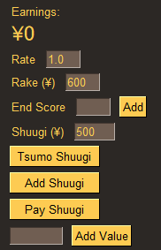

# Mahjong Money Tracker
 A tool to help track earnings while playing Mahjong.

## Usage
The Rate field will add a multiplier to the End Score when added. For tengo parlour rates, set this to 0.5. For tenpin, set it to 1.0.

The Rake field will subtract the given yen from your earnings whenever you submit an end score. Use this to account for table rake. In tengo, this is usually around 400-500, while it's around 600 for tenpin.

The End Score field is for entering your end-of-game score, after oka and uma. In Tenhou and Majsoul, this is shown at the end of the game, and will look something like `+64.2` or `-29.8`.

The Shuugi field will be referenced by the various Shuugi-related buttons. For tengo, shuugi is usually 200 yen, while in tenpin, it's usually 500 yen.

The Tsumo Shuugi button should be clicked for each shuugi you tsumo with. It will add Shuugi * 3 to your earnings.

The Add Shuugi button should be clicked for each shuugi you ron with. It will add the Shuugi value to your earnings.

The Pay Shuugi button should be clicked for each shuugi you have to pay. It will subtratct the Shuugi value from your earnings.

The final field is for adding or subtracting arbitrary numbers to your earnings. Maybe you want to track specific table rake, or start with the same value you left off with the previous day. Whatever your desire, you can use this field for it.

## What is shuugi?
Shuugi is a bonus payment that happens at certain times. When you tsumo, everyone pays you for each shuugi (500 yen from each, for example), while if you ron, only that person pays (500 yen from only that person).

A hand is often worth one shuugi per aka dora and ura dora the hand scores. Ippatsu is another common source of shuugi. In some parlours, you even get shuugi immediately for calling a kan. There's a lot of variations from place to place.

 ## Running the Code
 If you don't want to run a random .exe from the internet, here's how you can run the code itself.
 * If you don't have Python, download it from [the Python site.](https://www.python.org/downloads/) Version 3.7.3 will definitely work.
 * Install PySimpleGui using `pip install pysimplegui` in a terminal.
 * Double click the .py file, or use `python tracker.py` in a terminal.